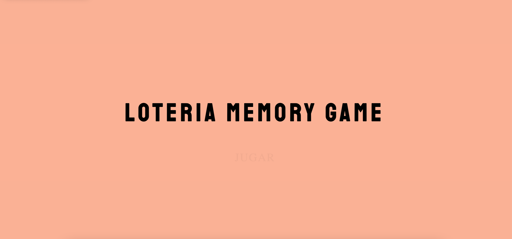
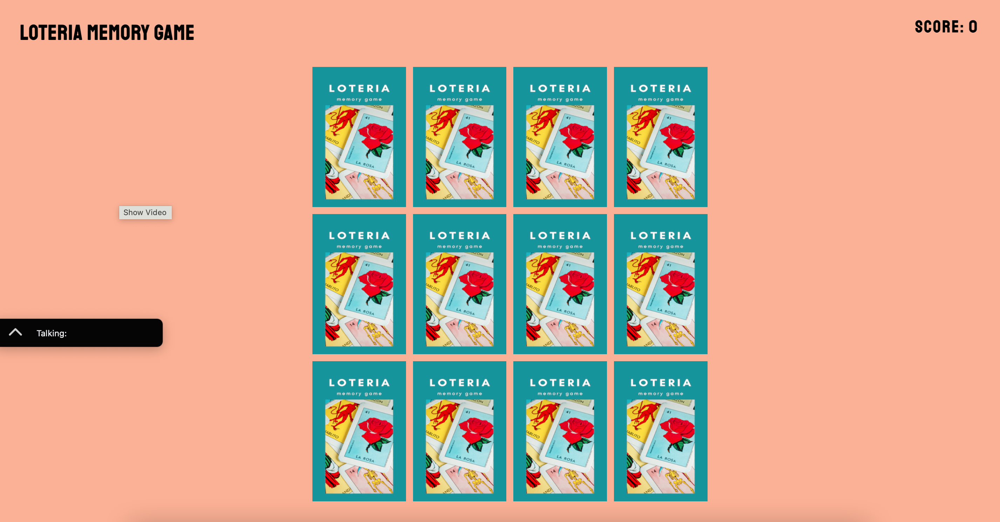

# Loteria Memory Game

This game was inspired by the Latinx game Cecilia grew up playing with her family called, "Loteria." Cecilia hopes to celebrate Latinx culture, and welcomes users to enjoy her game! 

## SCREENSHOTS
---
When the game opens, you will see this homepage: 

Once you click on "Jugar," then the cards will appear! 

## TECHNOLOGIES USED
---
Front-end: HTML5, CSS3, and vanilla JavaScript

## GAME PREMISE
---------------

- Users are greeted with the opening page of the game. They need to click on "Jugar" (Spanish for "play") to start the game. 

- Users click on the image they would like to flip. For each pair they find, users are alerted that they earned 20 points. The cards then disappear, leaving behind an empty space to mark where the cards used to be. 

- Users lose 5 points if they do not make a match. They are alerted when they do not make a match, and the cards immediately flip back to their place. 

- Once users find all possible matches, their success is celebrated with a message that pops up that congratulates them. They are then invited to play again. If users click on "play again," the game restarts to the beginning and the cards are shuffled. 

### What's Next?
- Include a musical timer that shuffles through popular Latinx songs.
- Improve code to be DRY-er. 
- Include the final score in the modal message. 
- Improve responsiveness.
- Improve accessibilities to make the game an enjoyable experience for everyone.

### Known Bugs?
- Game is best used when it takes up the entire computer screen.